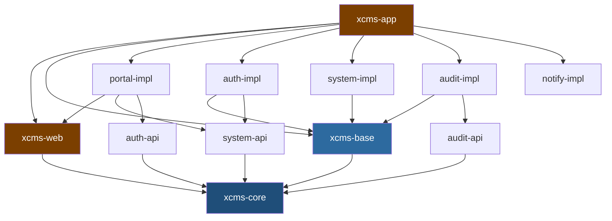
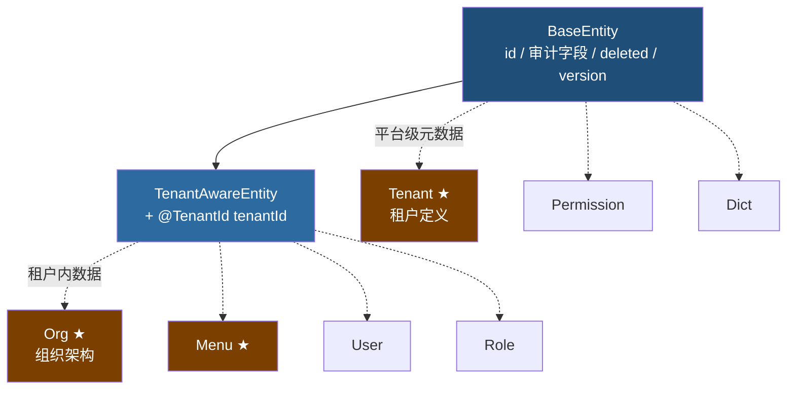
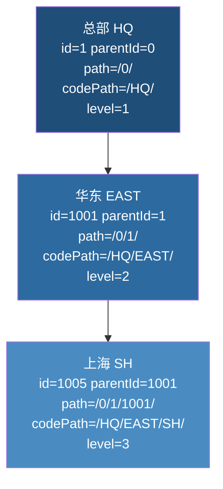
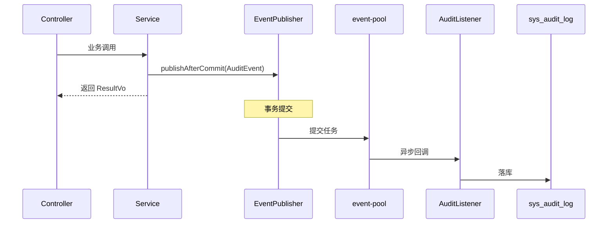

# XCMS 级联租户管理系统 · 完整技术方案 v1.2

---

## 一、项目定位与核心原则

XCMS 是一套支持**级联租户**的后端管理系统，采用模块化单体架构，保留未来拆分微服务的能力。仅后端，不含前端实现。

### 三条不可动摇的原则

**原则一：级联仅用于管理域。** 租户树只回答一个问题——「谁能管谁」。上级租户可以创建、查看、停用其子孙租户及其下的用户、角色等管理对象。业务数据一律按 `tenant_id` 精确等值隔离，上级租户看不到下级的业务数据。这条线划清后，才不会出现「树越深查询越慢」和「越权范围失控」两个经典坑。

**原则二：api / impl 严格分离。** 每个模块拆成 `xxx-api` 与 `xxx-impl`。api 只放接口定义、DTO、错误码常量，依赖面收敛到 `xcms-core` 与 `jakarta.validation-api`；impl 之间禁止相互依赖，跨模块调用只能通过对方的 api。这是未来拆微服务时唯一需要保证的纪律。

**原则三：全 POST 接口。** 统一 `/api/{module}/{aggregate}/{action}`，参数走请求体，HTTP 状态码统一 200，业务结果由响应体内的 `errorNo` 表达。异常分类（`BizException`/`ForbiddenException`/`UnauthorizedException`/`SystemException`/`ValidationException`）仅用于业务语义区分与日志分级，不影响 HTTP 状态码。

---

## 二、技术栈

| 类别 | 选型 | 说明 |
|---|---|---|
| JDK | 21 | 不启用虚拟线程，但代码写法兼容 |
| 框架 | Spring Boot 4.x | |
| 安全 | Spring Security 7 | 自定义 Token 过滤器链 |
| 持久层 | Spring Data JPA + Hibernate 7 | 开发阶段 `ddl-auto: update` 加速迭代；生产阶段 `ddl-auto: validate`，表结构由 DDL 脚本管理（生产 DDL 方案后续阶段完善） |
| 查询 | QueryDSL `io.github.openfeign.querydsl:7.5` | 原生 Jakarta，无 classifier 困扰 |
| 映射 | MapStruct 1.6.x | 全局 `@MapperConfig` |
| 数据库 | H2（`MODE=MySQL`）开发 / MySQL 8 生产 | |
| 主键 | 可插拔策略，默认雪花 ID；支持 `identity`（数据库自增）可选项 | 持久化前生成，自增模式由数据库回写 |
| 缓存 | `MemoryCache` 接口（定义于 `xcms-core`） | 当前提供基于 `ConcurrentHashMap` 的内存实现（`xcms-base`），满足单实例开发阶段需求；后续可按同一接口扩展 Caffeine / Redis 实现，业务代码零改动 |
| Token 存储 | `TokenStore` 接口（定义于 `xcms-core`） | 当前提供内存实现（`xcms-base`）；多服务场景下将提供 Redis / JWT 等集中式实现，接口契约不变 |
| 上下文透传 | TransmittableThreadLocal | |
| 构建 | Maven 多模块 | groupId `com.df4j.xctec` |

---

## 三、工程结构

```
xcms
├── pom.xml                             聚合 POM
├── xcms-dependencies                   BOM，统一版本
├── xcms-core                           契约层（接口/DTO/异常/错误码/上下文抽象）
├── xcms-base                           基础设施实现（JPA/ID/树/事件/缓存/租户隔离/TokenStore）
├── xcms-web                            Web 适配（异常/Jackson/过滤器/权限AOP/排序白名单）
├── xcms-system
│   ├── xcms-system-api
│   └── xcms-system-impl                租户、组织、用户、角色、权限
├── xcms-auth
│   ├── xcms-auth-api
│   └── xcms-auth-impl                  登录、Token 签发与校验
├── xcms-portal
│   ├── xcms-portal-api
│   └── xcms-portal-impl                BFF 层，聚合首页/菜单树/个人中心
├── xcms-audit
│   ├── xcms-audit-api
│   └── xcms-audit-impl                 异步审计日志
├── xcms-notify
│   ├── xcms-notify-api
│   └── xcms-notify-impl                站内信、邮件预留
└── xcms-app                            唯一 main
```

`xcms-common` 拆分为 `xcms-core` / `xcms-base` / `xcms-web` 三个模块，遵循**契约与实现分离**原则：接口与抽象放 core，基础设施实现放 base，Web 层适配放 web。各模块职责见 3.2。

### 3.1 包名规划

根包 `com.df4j.xctec.xcms`。

| 模块 | 根包 |
|---|---|
| `xcms-core` | `com.df4j.xctec.xcms.core` |
| `xcms-base` | `com.df4j.xctec.xcms.base` |
| `xcms-web` | `com.df4j.xctec.xcms.web` |
| `xcms-system-api` | `com.df4j.xctec.xcms.system.api` |
| `xcms-system-impl` | `com.df4j.xctec.xcms.system` |
| `xcms-auth-api` | `com.df4j.xctec.xcms.auth.api` |
| `xcms-auth-impl` | `com.df4j.xctec.xcms.auth` |
| `xcms-portal-api` | `com.df4j.xctec.xcms.portal.api` |
| `xcms-portal-impl` | `com.df4j.xctec.xcms.portal` |
| `xcms-audit-api` | `com.df4j.xctec.xcms.audit.api` |
| `xcms-audit-impl` | `com.df4j.xctec.xcms.audit` |
| `xcms-notify-api` | `com.df4j.xctec.xcms.notify.api` |
| `xcms-notify-impl` | `com.df4j.xctec.xcms.notify` |
| `xcms-app` | `com.df4j.xctec.xcms` |

#### `xcms-core` 内部分层（契约层，最薄）

只放接口、DTO、错误码、上下文抽象。禁止出现 `@Component`/`@Service`/`@Configuration`/`@Bean`，禁止依赖 Spring 上下文。依赖面仅 `jakarta.validation-api`、`jackson-annotations`、`transmittable-thread-local`。

```
com.df4j.xctec.xcms.core
├── result        ResultVo / PageVo / PageQuery / ErrorCode / CommonErrorCode
├── exception     BizException / ForbiddenException / UnauthorizedException / SystemException / ValidationException
├── trace         TraceContext（基于 TTL）
├── tenant        TenantInfo / TenantContext（runWith 作用域式）/ TenantCacheService（接口）/ TenantGuard（接口）/ TenantElevation（接口）
├── security      AuthPrincipal / TokenPair / TokenStore（接口）
├── event         EventPublisher（接口）/ AbstractEvent
├── cache         MemoryCache（接口）
├── tree          TreeNode（接口）/ TreePath（@Embeddable）
└── id            IdGenerateStrategy（接口）
```

#### `xcms-base` 内部分层（基础设施实现层）

JPA 基类、ID 生成策略、事件发布器、缓存实现、租户隔离的 Hibernate 适配。**不放 Web 相关内容。**

```
com.df4j.xctec.xcms.base
├── jpa
│   ├── (root)    BaseEntity / TenantAwareEntity（@MappedSuperclass，实现 Persistable）/ 审计填充
│   ├── id        XcmsIdGenerator（Hibernate Generator）/ SnowflakeIdStrategy / SegmentIdStrategy / IdentityIdStrategy / IdGeneratorHolder / IdGeneratorConfig / IdProperties
│   └── tree      TreeService（@Service，子树迁移实现）
├── tenant
│   ├── TenantIdentifierResolver（HibernatePropertiesCustomizer）
│   ├── DefaultTenantGuard（TenantGuard 接口默认实现，@ConditionalOnMissingBean）
│   ├── DefaultTenantElevation（TenantElevation 接口默认实现）
│   └── TenantContextHolder（TTL 持有，runWith 实现）
├── event         AsyncEventPublisher / EventBus / EventExecutorConfig
├── cache         DefaultMemoryCache（MemoryCache 接口默认实现，@ConditionalOnMissingBean）
└── security      MemoryTokenStore（TokenStore 接口默认实现，@ConditionalOnMissingBean）
```

#### `xcms-web` 内部分层（Web 适配层）

全局异常处理、Jackson 配置、MapStruct 全局配置、Security 过滤器链、权限注解 AOP、排序白名单。**不放业务逻辑。**

```
com.df4j.xctec.xcms.web
├── GlobalExceptionHandler（统一异常 → ResultVo，HTTP 一律 200）
├── JacksonConfig（Long/BigInteger/BigDecimal 转字符串、LocalDateTime 格式化）
├── XcmsMapperConfig（@MapperConfig，unmappedTargetPolicy = ERROR）
├── filter         TraceIdFilter / TokenAuthenticationFilter / TenantContextFilter
├── security       @RequiresPermission 注解 / PermissionAspect（AOP）
├── datascope      DataScopeResolver / @DataScopeAware（可选）
└── sort           SortResolver（排序白名单统一机制，见 7.3）
```

启动类落在根包，默认组件扫描覆盖全部模块：

```java
package com.df4j.xctec.xcms;

@SpringBootApplication
@EnableJpaAuditing
public class XcmsApplication {
    public static void main(String[] args) {
        SpringApplication.run(XcmsApplication.class, args);
    }
}
```

### 3.2 依赖关系



**铁律**：图中不存在任何 impl → impl 的箭头。

### 3.3 模块依赖纪律

1. **`*-api` 模块只依赖 `xcms-core`**，禁止依赖 `xcms-base`/`xcms-web`。这样 api jar 保持轻量，拆微服务时作为契约包对外发布，传递依赖面趋近于零。
2. **`xcms-base` 不依赖 `xcms-web`**，反之亦然。二者都依赖 `xcms-core`。Web 层与持久层正交。
3. **接口与默认实现成对出现**：`xcms-core` 定义接口，`xcms-base`/`xcms-web` 提供 `@ConditionalOnMissingBean` 默认实现。业务模块可覆盖。
4. **默认实现的替换路径**：`MemoryCache` → 未来 Caffeine/Redis 实现；`MemoryTokenStore` → 未来 Redis/JWT 实现；`AsyncEventPublisher` → 未来 MQ 实现。切换时只需新实现 + 配置，core 接口不变。
5. **自动装配**：`xcms-base`/`xcms-web` 的配置类通过 `META-INF/spring/org.springframework.boot.autoconfigure.AutoConfiguration.imports` 注册，仅在 classpath 存在时生效。不需要的 impl（如 notify-impl 无需 Web）不引 web 模块即可不装配。

---

## 四、实体基础设施

### 4.1 继承体系：两条分支 + 横向能力接口

「租户隔离」与「树形结构」是两个正交维度，不用继承链串联。



★ 表示实现 `TreeNode` 接口，可出现在任意分支。

关键区分：

| 概念 | 含义 | 是否有 `tenant_id` |
|---|---|---|
| `Tenant` 实体 | 租户的**定义**，管理域元数据 | **无** |
| `TenantAwareEntity` | **属于**某租户的数据 | 有 |

`Tenant` 绝不能带 `@TenantId`——否则 Hibernate 会在查 `sys_tenant` 时自动追加 `tenant_id = 当前租户`，级联下钻将查不到任何子租户，从根上摧毁管理能力。`Permission`、`Dict` 等平台级字典同理。

### 4.2 `BaseEntity`

```java
package com.df4j.xctec.xcms.base.jpa;

@MappedSuperclass
@Getter @Setter
public abstract class BaseEntity implements Persistable<Long> {

    @Id
    @GeneratedValue(generator = "xcms-id")
    @GenericGenerator(name = "xcms-id", type = XcmsIdGenerator.class)
    @Column(name = "id", nullable = false, updatable = false)
    private Long id;

    @CreatedBy
    @Column(name = "created_by", updatable = false)
    private Long createdBy;

    @CreatedDate
    @Column(name = "created_at", updatable = false)
    private LocalDateTime createdAt;

    @LastModifiedBy
    @Column(name = "updated_by")
    private Long updatedBy;

    @LastModifiedDate
    @Column(name = "updated_at")
    private LocalDateTime updatedAt;

    @Column(name = "deleted", nullable = false)
    private Boolean deleted = Boolean.FALSE;

    @Version
    @Column(name = "version")
    private Integer version;

    /** 配合预生成 ID，避免 save 前的多余 select */
    @Transient
    private transient boolean isNew = true;

    @Override
    public boolean isNew() {
        return isNew;
    }

    @PostPersist
    @PostLoad
    void markNotNew() {
        this.isNew = false;
    }
}

@MappedSuperclass
@Getter @Setter
public abstract class TenantAwareEntity extends BaseEntity {

    @TenantId
    @Column(name = "tenant_id", nullable = false, updatable = false)
    private Long tenantId;
}
```

### 4.3 可插拔 ID 生成

ID 策略不写死在实体上，由配置决定。雪花 / 号段 ID 在 `persist` 之前生成，这是树路径能一次写入的前提。数据库自增（`identity`）作为可选项支持：自增模式下 ID 由数据库在 INSERT 后回写，但因树路径定义不依赖自身 id（见 5.1），仍可一次写入。

```java
package com.df4j.xctec.xcms.core.id;

public interface IdGenerateStrategy {

    /** 由数据库产生 ID 时返回 true，此时 nextId() 不会被调用 */
    default boolean databaseGenerated() {
        return false;
    }

    Long nextId();
    String name();
}

public class SnowflakeIdStrategy implements IdGenerateStrategy {
    // 标准雪花算法实现
    @Override
    public Long nextId() { /* ... */ }
    @Override
    public String name() { return "snowflake"; }
}

public class SegmentIdStrategy implements IdGenerateStrategy {
    // 号段模式，依赖号段表
    @Override
    public Long nextId() { /* ... */ }
    @Override
    public String name() { return "segment"; }
}

public class IdentityIdStrategy implements IdGenerateStrategy {

    @Override
    public boolean databaseGenerated() {
        return true;
    }

    @Override
    public Long nextId() {
        throw new UnsupportedOperationException("IDENTITY 由数据库生成");
    }

    @Override
    public String name() {
        return "identity";
    }
}
```

Hibernate 允许一个 `Generator` 同时实现 `BeforeExecutionGenerator` 与 `OnExecutionGenerator`，运行期按 `generatedOnExecution()` 分流：

```java
public class XcmsIdGenerator implements BeforeExecutionGenerator, OnExecutionGenerator {

    /** true 走数据库自增，false 走 Java 侧生成 */
    @Override
    public boolean generatedOnExecution() {
        return IdGeneratorHolder.get().databaseGenerated();
    }

    @Override
    public EnumSet<EventType> getEventTypes() {
        return EventTypeSets.INSERT_ONLY;
    }

    // ---- BeforeExecution 分支：雪花 / 号段 ----
    @Override
    public Object generate(SharedSessionContractImplementor session, Object owner,
                           Object currentValue, EventType eventType) {
        // 允许业务预先赋值（数据迁移场景）
        if (owner instanceof BaseEntity e && e.getId() != null) {
            return e.getId();
        }
        return IdGeneratorHolder.get().nextId();
    }

    // ---- OnExecution 分支：数据库自增 ----
    @Override
    public boolean referenceColumnsInSql(Dialect dialect) {
        return false;                  // INSERT 语句不包含 id 列
    }

    @Override
    public String[] getReferencedColumnValues(Dialect dialect) {
        return null;
    }

    @Override
    public boolean writePropertyValue() {
        return false;                  // 值由数据库回写
    }
}
```

配置装配，注入时机早于任何实体持久化：

```java
@Configuration
@EnableConfigurationProperties(IdProperties.class)
public class IdGeneratorConfig {

    @Bean
    @ConditionalOnProperty(name = "xcms.id.type", havingValue = "snowflake", matchIfMissing = true)
    public IdGenerateStrategy snowflakeStrategy(IdProperties props) {
        return new SnowflakeIdStrategy(props.getWorkerId(), props.getDatacenterId());
    }

    @Bean
    @ConditionalOnProperty(name = "xcms.id.type", havingValue = "segment")
    public IdGenerateStrategy segmentStrategy(DataSource ds, IdProperties props) {
        return new SegmentIdStrategy(ds, props.getStep());
    }

    @Bean
    @ConditionalOnProperty(name = "xcms.id.type", havingValue = "identity")
    public IdGenerateStrategy identityStrategy() {
        return new IdentityIdStrategy();
    }

    /** 早于 EntityManagerFactory 完成注入 */
    @Bean
    public static BeanFactoryPostProcessor idHolderInitializer() {
        return bf -> IdGeneratorHolder.set(bf.getBean(IdGenerateStrategy.class));
    }
}
```

```yaml
xcms:
  id:
    type: snowflake        # snowflake | segment | identity
    worker-id: 1
    datacenter-id: 1
    step: 1000
```

`identity` 模式下，DDL 需让 Hibernate 将主键列建成自增（`AUTO_INCREMENT`）。推荐生产使用真实 DDL 脚本建表并以 `ddl-auto: validate` 校验，避免依赖 Hibernate 自动推导列类型。

收益：切换策略改一行 yaml；数据迁移可保留原 id；单测直接注入固定序列策略，无需数据库。

**三种策略对比**

| 维度 | 雪花 | 号段 | 数据库自增 |
|---|---|---|---|
| 树路径能否一次写入 | 是 | 是 | **是**（因 `path` 不含自身 id） |
| 批量插入性能 | 高 | 高 | 中（部分 JDBC 驱动 batch 受限） |
| 多实例部署 | 需分配 workerId | 天然支持 | 天然支持 |
| ID 可预测性 | 低（安全性好） | 中 | **高（可枚举，有遍历风险）** |
| 跨库迁移 / 分库 | 友好 | 友好 | 冲突 |
| DDL 依赖 | 无 | 需号段表 | 列须为 `AUTO_INCREMENT` |

**选型约定**：保留三种策略，`identity` 作为可选项而非默认；**默认仍用雪花**。主要理由是 ID 可预测性——管理系统的租户 id、用户 id 若能被枚举，配合任何一个越权漏洞都会被放大成批量遍历。雪花 ID 虽不是安全边界，但能显著抬高试探成本。若客户环境强制自增，切 yaml 即可，业务代码零改动。

---

## 五、树形模型

### 5.1 双路径定义

所有树（租户、组织、菜单）共用同一套规则。

| 字段 | 组成 | 是否含自身 | 示例 |
|---|---|---|---|
| `parent_id` | 父节点 id，**根节点为 0** | — | `1001` |
| `path` | 祖先 **id** 拼接 | **不含自身** | `/0/1/1001/` |
| `code_path` | 父的 `code_path` + 自身 `code` | **含自身** | `/HQ/EAST/SH/` |

两者均以 `/` 包围，避免 `LIKE '/1/10%'` 误匹配 `/1/100`。`path` 用于 SQL 下钻，`code_path` 用于日志可读、导入导出、按业务编码定位。

> **设计要点**：因 `path` 不含自身 id，仅依赖父节点 id（父节点已入库，id 必定存在），`code_path` 仅依赖自身业务编码 `code`。故无论采用雪花 / 号段 / 数据库自增哪种 ID 策略，树路径均可在 `persist` 前一次性计算并写入，无需二次 UPDATE。`descendantPathPrefix()` 等依赖自身 id 的方法只在查询期调用，彼时实体已入库，id 早已存在。



### 5.2 `TreeNode` 接口与 `TreePath` 组件

`TreeNode` 接口与 `TreePath`（`@Embeddable`）定义于 `xcms-core`，`TreeService` 实现在 `xcms-base`：

```java
package com.df4j.xctec.xcms.core.tree;

public interface TreeNode {

    Long ROOT_PARENT_ID = 0L;
    String SEPARATOR = "/";

    Long getId();
    Long getParentId();
    void setParentId(Long parentId);

    /** 用于拼 codePath 的业务编码 */
    String getNodeCode();

    TreePath getTreePath();
    void setTreePath(TreePath treePath);

    default boolean isRoot() {
        return ROOT_PARENT_ID.equals(getParentId());
    }

    /** 下钻前缀：所有子孙的 path 均以此开头 */
    default String descendantPathPrefix() {
        return getTreePath().getPath() + getId() + SEPARATOR;
    }
}

@Embeddable
@Getter @Setter
@NoArgsConstructor
@AllArgsConstructor
public class TreePath {

    @Column(name = "path", nullable = false, length = 1024)
    private String path;

    @Column(name = "code_path", nullable = false, length = 2048)
    private String codePath;

    @Column(name = "level", nullable = false)
    private Integer level;
}
```

因 `path` 不含自身，查询子孙时须拼上自己的 id，由 `descendantPathPrefix()` 统一封装。

### 5.3 `TreeService`

树逻辑不放在实体基类，抽成服务，任何 `TreeNode` 均可复用。

```java
package com.df4j.xctec.xcms.base.jpa.tree;

@Service
public class TreeService {

    /** 新增节点时计算路径，parent 为 null 表示根 */
    public <T extends TreeNode> void fillPath(T node, T parent) {
        if (parent == null) {
            node.setParentId(TreeNode.ROOT_PARENT_ID);
            node.setTreePath(new TreePath(
                    TreeNode.SEPARATOR + TreeNode.ROOT_PARENT_ID + TreeNode.SEPARATOR,
                    TreeNode.SEPARATOR + node.getNodeCode() + TreeNode.SEPARATOR,
                    1));
        } else {
            node.setParentId(parent.getId());
            node.setTreePath(new TreePath(
                    parent.descendantPathPrefix(),
                    parent.getTreePath().getCodePath() + node.getNodeCode() + TreeNode.SEPARATOR,
                    parent.getTreePath().getLevel() + 1));
        }
    }

    public <T extends TreeNode> void validateMove(T node, T newParent) {
        if (newParent == null) {
            return;
        }
        if (Objects.equals(node.getId(), newParent.getId())) {
            throw new BizException(CommonErrorCode.TREE_MOVE_TO_SELF);
        }
        if (newParent.getTreePath().getPath().startsWith(node.descendantPathPrefix())) {
            throw new BizException(CommonErrorCode.TREE_MOVE_TO_DESCENDANT);
        }
    }

    public List<Long> ancestorIds(TreeNode node) {
        return Arrays.stream(node.getTreePath().getPath().split(TreeNode.SEPARATOR))
                .filter(StringUtils::hasText)
                .map(Long::valueOf)
                .filter(id -> !TreeNode.ROOT_PARENT_ID.equals(id))
                .toList();
    }
}
```

### 5.4 子树迁移

改父时自身与全部子孙的三个字段一并重算，单条 UPDATE 完成，无需递归。

```java
@Transactional
public void move(Long nodeId, Long newParentId) {
    Tenant node = repo.findById(nodeId)
            .orElseThrow(() -> new BizException(SystemErrorCode.TENANT_NOT_FOUND, nodeId));
    tenantGuard.assertManageable(newParentId);

    Tenant newParent = TreeNode.ROOT_PARENT_ID.equals(newParentId)
            ? null
            : repo.findById(newParentId)
                  .orElseThrow(() -> new BizException(SystemErrorCode.TREE_PARENT_NOT_FOUND));
    treeService.validateMove(node, newParent);

    String oldPathPrefix = node.descendantPathPrefix();
    String oldCodePath = node.getTreePath().getCodePath();
    int oldLevel = node.getTreePath().getLevel();

    treeService.fillPath(node, newParent);

    String newPathPrefix = node.descendantPathPrefix();
    int levelDelta = node.getTreePath().getLevel() - oldLevel;

    queryFactory.update(tenant)
            .set(tenant.treePath.path, Expressions.stringTemplate(
                    "concat({0}, substring({1}, {2}))",
                    newPathPrefix, tenant.treePath.path, oldPathPrefix.length() + 1))
            .set(tenant.treePath.codePath, Expressions.stringTemplate(
                    "concat({0}, substring({1}, {2}))",
                    node.getTreePath().getCodePath(), tenant.treePath.codePath,
                    oldCodePath.length() + 1))
            .set(tenant.treePath.level, tenant.treePath.level.add(levelDelta))
            .where(tenant.treePath.path.startsWith(oldPathPrefix))
            .execute();
}
```

---

## 六、租户模型

### 6.1 实体

```java
package com.df4j.xctec.xcms.system.domain;

@Entity
@Table(name = "sys_tenant", indexes = {
        @Index(name = "idx_tenant_parent", columnList = "parent_id"),
        @Index(name = "idx_tenant_path", columnList = "path"),
        @Index(name = "idx_tenant_code", columnList = "code", unique = true)
})
@Getter @Setter
public class Tenant extends BaseEntity implements TreeNode {

    @Column(name = "code", nullable = false, length = 64)
    private String code;

    @Column(name = "name", nullable = false, length = 128)
    private String name;

    @Column(name = "parent_id", nullable = false)
    private Long parentId = ROOT_PARENT_ID;

    @Embedded
    private TreePath treePath;

    @Column(name = "sort_no")
    private Integer sortNo;

    @Column(name = "status", nullable = false)
    private Integer status;     // 1 正常 0 停用

    @Override
    public String getNodeCode() {
        return code;
    }
}
```

组织架构作为租户内的树：

```java
@Entity
@Table(name = "sys_org", indexes = {
        @Index(name = "idx_org_tenant_parent", columnList = "tenant_id,parent_id"),
        @Index(name = "idx_org_path", columnList = "path")
})
@Getter @Setter
public class Org extends TenantAwareEntity implements TreeNode {

    @Column(name = "code", nullable = false, length = 64)
    private String code;

    @Column(name = "name", nullable = false, length = 128)
    private String name;

    @Column(name = "parent_id", nullable = false)
    private Long parentId = ROOT_PARENT_ID;

    @Embedded
    private TreePath treePath;

    @Column(name = "sort_no")
    private Integer sortNo;

    @Override
    public String getNodeCode() {
        return code;
    }
}
```

### 6.2 租户上下文

```java
package com.df4j.xctec.xcms.core.tenant;

public record TenantInfo(
        Long tenantId, String tenantCode, String name,
        String path, String codePath, Integer level) {

    /** 子孙 path 前缀 */
    public String scopePrefix() {
        return path + tenantId + "/";
    }
}

public final class TenantContext {

    private static final ThreadLocal<TenantInfo> HOLDER = new TransmittableThreadLocal<>();

    private TenantContext() {
    }

    public static Optional<TenantInfo> current() {
        return Optional.ofNullable(HOLDER.get());
    }

    public static Optional<Long> currentTenantId() {
        return current().map(TenantInfo::tenantId);
    }

    public static Long requireTenantId() {
        return currentTenantId().orElseThrow(
                () -> new BizException(CommonErrorCode.TENANT_CONTEXT_MISSING));
    }

    public static void clear() {
        HOLDER.remove();
    }

    /** 作用域式使用，自动还原前值，兼容嵌套 */
    public static <T> T runWith(TenantInfo info, Supplier<T> action) {
        TenantInfo previous = HOLDER.get();
        HOLDER.set(info);
        try {
            return action.get();
        } finally {
            if (previous == null) {
                HOLDER.remove();
            } else {
                HOLDER.set(previous);
            }
        }
    }

    public static void runWith(TenantInfo info, Runnable action) {
        runWith(info, () -> { action.run(); return null; });
    }
}
```

不暴露裸 `set()`，强制走 `runWith`，从 API 层面杜绝线程池上下文污染。

### 6.3 业务数据隔离

```java
package com.df4j.xctec.xcms.base.tenant;

@Component
public class TenantIdentifierResolver implements CurrentTenantIdentifierResolver<Long>,
        HibernatePropertiesCustomizer {

    @Override
    public Long resolveCurrentTenantIdentifier() {
        return TenantContext.currentTenantId().orElse(SYSTEM_TENANT_ID);
    }

    @Override
    public boolean validateExistingCurrentSessions() {
        return true;
    }

    @Override
    public void customize(Map<String, Object> props) {
        props.put(AvailableSettings.MULTI_TENANT_IDENTIFIER_RESOLVER, this);
    }
}
```

Hibernate `@TenantId` 自动在所有查询与写入上追加 `tenant_id = ?`，业务代码无感知且无法遗漏。

### 6.4 管理域越权校验

`TenantGuard` 接口定义于 `xcms-core`，默认实现 `DefaultTenantGuard` 在 `xcms-base`（`@ConditionalOnMissingBean`，可被业务模块覆盖）：

```java
package com.df4j.xctec.xcms.base.tenant;

@Component
@ConditionalOnMissingBean(TenantGuard.class)
@RequiredArgsConstructor
public class DefaultTenantGuard implements TenantGuard {

    private final TenantCacheService tenantCache;

    @Override
    public void assertManageable(Long targetTenantId) {
        Long currentId = TenantContext.requireTenantId();
        if (Objects.equals(currentId, targetTenantId)) {
            return;
        }
        TenantInfo current = tenantCache.get(currentId);
        TenantInfo target = tenantCache.get(targetTenantId);
        if (target == null || !target.path().startsWith(current.scopePrefix())) {
            throw new ForbiddenException(SystemErrorCode.TENANT_NOT_MANAGEABLE, targetTenantId);
        }
    }

    @Override
    public String manageableScopePrefix() {
        return tenantCache.get(TenantContext.requireTenantId()).scopePrefix();
    }
}
```

下钻查询需显式包含自身：

```java
BooleanBuilder scope = new BooleanBuilder()
        .or(tenant.id.eq(TenantContext.requireTenantId()))
        .or(tenant.treePath.path.startsWith(tenantGuard.manageableScopePrefix()));
```

### 6.5 受控提权

不对前端暴露「切换租户视角」接口。跨租户操作只能由服务端在明确业务语义下发起，且必留审计。`TenantElevation` 接口定义于 `xcms-core`，默认实现 `DefaultTenantElevation` 在 `xcms-base`：

```java
package com.df4j.xctec.xcms.base.tenant;

@Component
@ConditionalOnMissingBean(TenantElevation.class)
@RequiredArgsConstructor
public class DefaultTenantElevation implements TenantElevation {

    private final TenantGuard guard;
    private final TenantCacheService tenantCache;
    private final EventPublisher eventPublisher;

    @Override
    public <T> T runAsTenant(Long targetTenantId, Supplier<T> action) {
        guard.assertManageable(targetTenantId);
        TenantInfo from = TenantContext.current().orElse(null);
        TenantInfo to = tenantCache.get(targetTenantId);
        eventPublisher.publish(new TenantElevationEvent(
                from == null ? null : from.tenantId(), targetTenantId,
                SecurityContexts.currentUserId()));
        return TenantContext.runWith(to, action);
    }
}
```

---

## 七、统一返回体

### 7.1 `ResultVo<T>`

```java
package com.df4j.xctec.xcms.core.result;

@JsonInclude(JsonInclude.Include.NON_NULL)
public record ResultVo<T>(
        String errorNo,
        String errorMsg,
        T data,
        String traceId,
        Long timestamp
) {

    public static <T> ResultVo<T> ok() {
        return ok(null);
    }

    public static <T> ResultVo<T> ok(T data) {
        return new ResultVo<>(null, null, data,
                TraceContext.currentTraceId(), System.currentTimeMillis());
    }

    public static <T> ResultVo<T> fail(ErrorCode code, Object... args) {
        return new ResultVo<>(code.code(), code.format(args), null,
                TraceContext.currentTraceId(), System.currentTimeMillis());
    }

    public static <T> ResultVo<T> fail(String errorNo, String errorMsg) {
        return new ResultVo<>(errorNo, errorMsg, null,
                TraceContext.currentTraceId(), System.currentTimeMillis());
    }
}
```

判定成功的唯一标准是 `errorNo == null`。配合 `NON_NULL`，成功响应中不出现错误字段。

### 7.2 `PageVo<T>`

分页作为 `data` 载体，不与 `ResultVo` 平级。

```java
public record PageVo<T>(
        List<T> records,
        Long total,
        Integer pageNo,
        Integer pageSize,
        Integer totalPages
) {

    public static <T> PageVo<T> of(Page<T> page) {
        return new PageVo<>(page.getContent(), page.getTotalElements(),
                page.getNumber() + 1, page.getSize(), page.getTotalPages());
    }

    public static <E, T> PageVo<T> of(Page<E> page, Function<E, T> converter) {
        return of(page.map(converter));
    }

    public static <T> PageVo<T> of(List<T> records, Long total, Integer pageNo, Integer pageSize) {
        int totalPages = (pageSize == null || pageSize <= 0)
                ? 0 : (int) Math.ceil((double) total / pageSize);
        return new PageVo<>(records, total, pageNo, pageSize, totalPages);
    }

    public static <T> PageVo<T> empty(Integer pageNo, Integer pageSize) {
        return new PageVo<>(Collections.emptyList(), 0L, pageNo, pageSize, 0);
    }
}
```

`pageNo` 对外从 1 开始，偏移换算封装在 `of()` 内部。

### 7.3 `PageQuery`

```java
@Data
public class PageQuery {

    @Min(value = 1, message = "页码最小为 1")
    private Integer pageNo = 1;

    @Min(value = 1, message = "每页条数最小为 1")
    @Max(value = 200, message = "每页条数最大为 200")
    private Integer pageSize = 20;

    /** 形如 createdAt,desc，由 SortResolver 映射为 QueryDSL 表达式 */
    private String orderBy;

    public Pageable toPageable() {
        return PageRequest.of(pageNo - 1, pageSize);
    }

    public Pageable toPageable(Sort sort) {
        return PageRequest.of(pageNo - 1, pageSize, sort);
    }

    public long offset() {
        return (long) (pageNo - 1) * pageSize;
    }
}
```

#### 排序白名单机制（`SortResolver`）

`orderBy` 绝不拼接进 SQL，由 `xcms-web` 提供统一的 `SortResolver` 抽象，各 impl 注册白名单：

1. `xcms-web` 定义 `SortResolver` 接口与默认实现。
2. 每个 impl 模块提供一个 `@Configuration` 类，注册 `Map<String, ComparableExpressionBase<?>>` 白名单 Bean（如 `SystemSortWhitelist`）。Map 的 key 用 DTO 字段名（前端可见），value 用 QueryDSL 路径表达式（安全）。
3. `SortResolver` 接收 `orderBy` 字符串（如 `createdAt,desc`），拆分为字段名 + 方向：
   - **命中白名单**：返回对应的 QueryDSL `OrderSpecifier`（如 `tenant.createdAt.desc()`）。
   - **未命中**：返回调用方传入的默认排序，并记 warn 日志。

收益：SQL 不拼接外部字符串，从根上防注入；白名单集中管理，各 impl 显式注册，未注册的字段无法排序；前端字段名与数据库列名解耦，可独立演进。

调用方式：

```java
List<Tenant> rows = queryFactory.selectFrom(tenant)
        .where(where)
        .orderBy(sortResolver.resolve(query.getOrderBy(), tenant.createdAt.desc()))
        .offset(query.offset())
        .limit(query.getPageSize())
        .fetch();
```

不需要排序的 impl 可不注册白名单，`SortResolver` 永远返回默认排序。

### 7.4 错误码与异常体系

错误码格式 `{模块}.{领域}.{错误}`。

```java
public interface ErrorCode {
    String code();
    String messageTemplate();

    default String format(Object... args) {
        return args == null || args.length == 0
                ? messageTemplate()
                : MessageFormat.format(messageTemplate(), args);
    }
}
```

| 异常类 | 语义 | HTTP | 日志级别 |
|---|---|---|---|
| `BizException` | 业务规则不满足 | 200 | warn |
| `ValidationException` | 参数校验失败 | 200 | warn |
| `UnauthorizedException` | 未登录 / Token 失效 | 200 | info |
| `ForbiddenException` | 越权、无权限 | 200 | warn |
| `SystemException` | 系统内部错误 | 200 | error |

异常分类仅用于业务语义区分与日志分级，HTTP 状态码一律 200。前端根据 `errorNo` 前缀（`security.*` / `tenant.*` / `common.*`）决定处理逻辑（跳登录页 / 提示无权限 / 表单回显 / 通用错误提示）。

常用错误码：

| 错误码 | 说明 |
|---|---|
| `common.param.invalid` | 参数校验失败 |
| `common.system.error` | 系统繁忙 |
| `common.tenant.contextMissing` | 租户上下文缺失 |
| `common.tree.moveToSelf` | 不能移动到自身 |
| `common.tree.moveToDescendant` | 不能移动到自己的子孙下 |
| `system.tenant.notFound` | 租户不存在 |
| `system.tenant.notManageable` | 无权管理目标租户 |
| `system.tree.parentNotFound` | 父节点不存在 |
| `system.tree.codeDuplicated` | 同级编码重复 |
| `auth.token.expired` | 登录已过期 |

```java
package com.df4j.xctec.xcms.web;

@RestControllerAdvice
@Slf4j
public class GlobalExceptionHandler {

    @ExceptionHandler(BizException.class)
    public ResponseEntity<ResultVo<Void>> handleBiz(BizException e) {
        log.warn("biz error: {} - {}", e.getErrorCode().code(), e.getMessage());
        return ResponseEntity.ok(ResultVo.fail(e.getErrorCode(), e.getArgs()));
    }

    @ExceptionHandler(UnauthorizedException.class)
    public ResponseEntity<ResultVo<Void>> handleUnauthorized(UnauthorizedException e) {
        log.info("unauthorized: {} - {}", e.getErrorCode().code(), e.getMessage());
        return ResponseEntity.ok(ResultVo.fail(e.getErrorCode(), e.getArgs()));
    }

    @ExceptionHandler(ForbiddenException.class)
    public ResponseEntity<ResultVo<Void>> handleForbidden(ForbiddenException e) {
        log.warn("forbidden: {} - {}", e.getErrorCode().code(), e.getMessage());
        return ResponseEntity.ok(ResultVo.fail(e.getErrorCode(), e.getArgs()));
    }

    @ExceptionHandler(SystemException.class)
    public ResponseEntity<ResultVo<Void>> handleSystem(SystemException e) {
        log.error("system error: {} - {}", e.getErrorCode().code(), e.getMessage());
        return ResponseEntity.ok(ResultVo.fail(e.getErrorCode(), e.getArgs()));
    }

    @ExceptionHandler(MethodArgumentNotValidException.class)
    public ResponseEntity<ResultVo<Void>> handleValid(MethodArgumentNotValidException e) {
        String msg = e.getBindingResult().getFieldErrors().stream()
                .map(f -> f.getField() + ": " + f.getDefaultMessage())
                .collect(Collectors.joining("; "));
        return ResponseEntity.ok(ResultVo.fail(CommonErrorCode.VALIDATION_FAILED, msg));
    }

    @ExceptionHandler(Exception.class)
    public ResponseEntity<ResultVo<Void>> handleUnknown(Exception e) {
        log.error("system error", e);
        return ResponseEntity.ok(ResultVo.fail(CommonErrorCode.SYSTEM_ERROR, "系统繁忙，请稍后重试"));
    }
}
```

所有异常处理器统一返回 `ResponseEntity.ok(ResultVo.fail(...))`，HTTP 状态码一律 200，不向前端暴露 `ex.getMessage()`（系统异常返回固定提示「系统繁忙，请稍后重试」）。

### 7.5 序列化约定

```java
package com.df4j.xctec.xcms.web;

@Configuration
public class JacksonConfig {

    @Bean
    public Jackson2ObjectMapperBuilderCustomizer customizer() {
        return builder -> {
            SimpleModule module = new SimpleModule();
            module.addSerializer(Long.class, ToStringSerializer.instance);
            module.addSerializer(Long.TYPE, ToStringSerializer.instance);
            module.addSerializer(BigInteger.class, ToStringSerializer.instance);
            module.addSerializer(BigDecimal.class, ToStringSerializer.instance);
            builder.modules(module);
            builder.simpleDateFormat("yyyy-MM-dd HH:mm:ss");
        };
    }
}
```

| Java 类型 | JSON 输出 | 用途 |
|---|---|---|
| `Long` / `BigInteger` / `BigDecimal` | 字符串 | 主键、金额，规避 JS 精度丢失 |
| `Integer` / `Short` / `Byte` | 数字 | 状态、层级、序号、计数 |
| `Boolean` | `true` / `false` | 不转 0/1 |
| `LocalDateTime` | `"yyyy-MM-dd HH:mm:ss"` | |

DTO 字段一律使用包装类型。选型纪律：**ID 用 `Long`，状态/层级/排序用 `Integer`**。

---

## 八、认证与 Token

### 8.1 抽象

不绑定 JWT，接口先行。`TokenStore` 接口定义于 `xcms-core`，当前默认实现在 `xcms-base`，多服务场景下将提供 Redis / JWT 等集中式实现，接口契约不变：

```java
package com.df4j.xctec.xcms.core.security;

public interface TokenStore {
    TokenPair issue(AuthPrincipal principal);
    Optional<AuthPrincipal> verify(String accessToken);
    TokenPair refresh(String refreshToken);
    void revoke(String accessToken);
    void revokeByUser(Long userId);
    void revokeByTenant(Long tenantId);
}

public record AuthPrincipal(
        Long userId, String username, Long tenantId,
        String tenantPath, String tenantCodePath,
        Set<String> permissions, Set<Long> roleIds) {}

public record TokenPair(String accessToken, String refreshToken,
                        Long expiresIn, Long refreshExpiresIn) {}
```

### 8.2 内存实现（当前默认，可替换）

当前提供基于内存的实现（`MemoryTokenStore`，`@ConditionalOnMissingBean`），满足单实例开发阶段需求。接受重启失效，多服务场景下替换为 Redis / JWT 实现：

```java
package com.df4j.xctec.xcms.base.security;

@Component
@ConditionalOnMissingBean(TokenStore.class)
public class MemoryTokenStore implements TokenStore {

    private final Map<String, TokenEntry> tokens = new ConcurrentHashMap<>();
    private final Map<Long, Set<String>> userIndex = new ConcurrentHashMap<>();
    private final Map<Long, Set<String>> tenantIndex = new ConcurrentHashMap<>();
    // 三索引保证按用户 / 按租户批量踢线 O(1) 定位
    // 定时任务扫描清理过期项
}
```

租户被停用时调用 `revokeByTenant`，其下所有在线用户立即失效——级联管理场景的刚需。

### 8.3 过滤器链

```
TraceIdFilter → TokenAuthenticationFilter → TenantContextFilter → SecurityFilterChain → Controller
```

`TenantContextFilter` 从 `AuthPrincipal` 取租户信息填入 `TenantContext`，`finally` 中 `clear()`。

---

## 九、权限模型

### 9.1 功能权限

标准 RBAC：`sys_user` — `sys_user_role` — `sys_role` — `sys_role_permission` — `sys_permission`。

权限码格式 `{模块}:{资源}:{操作}`：

```java
@PostMapping("/api/system/tenant/create")
@RequiresPermission("system:tenant:create")
public ResultVo<Long> create(@RequestBody @Valid TenantCreateDto dto) { ... }
```

### 9.2 数据权限：维度 × 策略

不绑死部门，抽象为「在哪个维度上」×「用什么策略」。

```java
public interface DataScopeDimension {
    String code();                              // tenant / org / region / customerGroup
    Path<?> column(EntityPath<?> entity);
    Set<Object> resolveValues(AuthPrincipal p, ScopeStrategy strategy);
}

public enum ScopeStrategy {
    ALL,            // 全部
    SELF,           // 仅本人创建
    CURRENT,        // 仅当前维度值
    HIERARCHY,      // 当前维度值及其下级
    ASSIGNED,       // 显式授权集合
    NONE            // 无权限
}
```

存储于 `sys_role_data_scope`：

| 字段 | 说明 |
|---|---|
| `role_id` | 角色 |
| `resource_type` | 资源类型，如 `TENANT` / `ORDER` |
| `dimension_code` | 维度编码 |
| `strategy` | 策略枚举 |
| `assigned_values` | ASSIGNED 时的取值集合（JSON） |

显式注入，不做隐式 AOP，保证 SQL 可预期：

```java
BooleanBuilder where = new BooleanBuilder()
        .and(order.deleted.isFalse())
        .and(dataScopeResolver.build(order, ResourceType.ORDER));
```

多角色取并集，`ALL` 短路，`NONE` 返回恒假条件。组织维度的 `HIERARCHY` 策略直接复用 `Org` 的 `path` 前缀匹配。

---

## 十、异步事件机制

### 10.1 设计

纯内存单通道，定位是**系统内解耦**，不承诺跨进程可靠投递。`EventPublisher` 接口定义于 `xcms-core`，`AsyncEventPublisher` 实现在 `xcms-base`：

```java
package com.df4j.xctec.xcms.core.event;

public interface EventPublisher {
    void publish(Object event);
    void publishAfterCommit(Object event);
    void publishAll(Collection<?> events);
}
```

- `publish`：立即异步投递。
- `publishAfterCommit`：注册 `TransactionSynchronization`，事务提交后投递，避免「事件已发但事务回滚」。审计走这条。

### 10.2 执行器

```java
@Bean("eventExecutor")
public Executor eventExecutor() {
    ThreadPoolTaskExecutor executor = new ThreadPoolTaskExecutor();
    executor.setCorePoolSize(4);
    executor.setMaxPoolSize(16);
    executor.setQueueCapacity(2048);
    executor.setThreadNamePrefix("xcms-event-");
    executor.setRejectedExecutionHandler(new ThreadPoolExecutor.CallerRunsPolicy());
    executor.initialize();
    return TtlExecutors.getTtlExecutor(executor);
}
```

`TtlExecutors` 包装保证 `TenantContext` 与 `TraceContext` 正确透传。拒绝策略选 `CallerRunsPolicy`：宁可拖慢主线程，也不静默丢审计。

写法上避免 `synchronized` 块内阻塞、避免 `ThreadLocal` 裸用，为将来一行配置切换虚拟线程留好余地。

### 10.3 审计链路



审计事件携带：操作人、租户、模块、动作、目标对象、入参摘要、结果、IP、traceId、耗时。

---

## 十一、缓存

`MemoryCache` 接口定义于 `xcms-core`，当前提供基于内存的实现（`DefaultMemoryCache`，`@ConditionalOnMissingBean`），满足单实例开发阶段需求。后续可按同一接口扩展 Caffeine / Redis 实现，业务代码零改动：

```java
package com.df4j.xctec.xcms.core.cache;

public interface MemoryCache<K, V> {
    V get(K key);
    V get(K key, Function<K, V> loader);
    void put(K key, V value);
    void put(K key, V value, Duration ttl);
    void evict(K key);
    void clear();
    int size();
}
```

当前默认实现基于 `ConcurrentHashMap` + 单线程 `ScheduledExecutor` 清理过期项，支持容量上限与 LRU 淘汰。

主要用途：
- **租户树缓存**：`TenantCacheService` 缓存 `id → TenantInfo`，租户变更时通过事件失效。这是解耦 tenant 与其他模块的关键——其他模块只读缓存副本，不直接查 `sys_tenant`。
- 权限码缓存、字典缓存。

---

## 十二、Maven 配置要点

### 12.1 注解处理器顺序（严格）

```xml
<annotationProcessorPaths>
    <path>
        <groupId>org.projectlombok</groupId>
        <artifactId>lombok</artifactId>
    </path>
    <path>
        <groupId>org.projectlombok</groupId>
        <artifactId>lombok-mapstruct-binding</artifactId>
        <version>0.2.0</version>
    </path>
    <path>
        <groupId>io.github.openfeign.querydsl</groupId>
        <artifactId>querydsl-apt</artifactId>
        <version>7.5</version>
        <classifier>jpa</classifier>
    </path>
    <path>
        <groupId>org.mapstruct</groupId>
        <artifactId>mapstruct-processor</artifactId>
    </path>
</annotationProcessorPaths>
```

顺序错乱会导致 Q 类或 Mapper 实现类生成失败，这是该组合最常见的踩坑点。`@Embeddable` 的 `TreePath` 会生成 `QTreePath`，在实体 Q 类中以 `tenant.treePath.path` 形式访问。

### 12.2 MapStruct 全局配置

```java
package com.df4j.xctec.xcms.web;

@MapperConfig(
        componentModel = "spring",
        unmappedTargetPolicy = ReportingPolicy.ERROR,
        nullValueCheckStrategy = NullValueCheckStrategy.ALWAYS
)
public interface XcmsMapperConfig {}
```

`unmappedTargetPolicy = ERROR` 强制字段显式映射，字段增删时编译期即报错。DTO 中的 `path` / `codePath` / `level` 需用 `@Mapping(source = "treePath.path", target = "path")` 展平。

---

## 十三、接口示例

```java
package com.df4j.xctec.xcms.system.controller;

@RestController
@RequiredArgsConstructor
public class TenantController {

    private final TenantService tenantService;

    @PostMapping("/api/system/tenant/create")
    @RequiresPermission("system:tenant:create")
    public ResultVo<Long> create(@RequestBody @Valid TenantCreateDto dto) {
        return ResultVo.ok(tenantService.create(dto));
    }

    @PostMapping("/api/system/tenant/page")
    @RequiresPermission("system:tenant:query")
    public ResultVo<PageVo<TenantVo>> page(@RequestBody @Valid TenantPageQuery query) {
        return ResultVo.ok(tenantService.page(query));
    }

    @PostMapping("/api/system/tenant/tree")
    @RequiresPermission("system:tenant:query")
    public ResultVo<List<TenantTreeVo>> tree() {
        return ResultVo.ok(tenantService.manageableTree());
    }

    @PostMapping("/api/system/tenant/move")
    @RequiresPermission("system:tenant:update")
    public ResultVo<Void> move(@RequestBody @Valid TenantMoveDto dto) {
        tenantService.move(dto.getId(), dto.getParentId());
        return ResultVo.ok();
    }
}
```

分页实现：

```java
public PageVo<TenantVo> page(TenantPageQuery query) {
    Long selfId = TenantContext.requireTenantId();
    BooleanBuilder where = new BooleanBuilder()
            .and(tenant.deleted.isFalse())
            .and(new BooleanBuilder()
                    .or(tenant.id.eq(selfId))
                    .or(tenant.treePath.path.startsWith(tenantGuard.manageableScopePrefix())));

    Long total = queryFactory.select(tenant.count()).from(tenant).where(where).fetchOne();
    if (total == null || total == 0) {
        return PageVo.empty(query.getPageNo(), query.getPageSize());
    }

    List<Tenant> rows = queryFactory.selectFrom(tenant)
            .where(where)
            .orderBy(sortResolver.resolve(query.getOrderBy(), tenant.createdAt.desc()))
            .offset(query.offset())
            .limit(query.getPageSize())
            .fetch();

    return PageVo.of(tenantMapper.toVoList(rows), total, query.getPageNo(), query.getPageSize());
}
```

响应示例：

成功响应（`errorNo` 为 null，配合 `@JsonInclude(NON_NULL)` 隐藏错误字段）：

```json
{
  "data": {
    "records": [
      {
        "id": "1005",
        "code": "SH",
        "name": "上海",
        "parentId": "1001",
        "path": "/0/1/1001/",
        "codePath": "/HQ/EAST/SH/",
        "level": 3,
        "status": 1
      }
    ],
    "total": "128",
    "pageNo": 1,
    "pageSize": 20,
    "totalPages": 7
  },
  "traceId": "a1b2c3d4",
  "timestamp": 1754179200000
}
```

失败响应（HTTP 200，业务结果由 `errorNo` 表达）：

```json
{
  "errorNo": "system.tenant.notManageable",
  "errorMsg": "无权管理目标租户：1005",
  "traceId": "a1b2c3d4",
  "timestamp": 1754179200000
}
```

---

## 十四、落地阶段

| 阶段 | 内容 | 验收 |
|---|---|---|
| 1 | 父 POM、BOM、模块骨架（`xcms-core`/`xcms-base`/`xcms-web` + 各业务模块 api/impl） | `mvn clean install` 通过；api 模块依赖面仅 `xcms-core` + `jakarta.validation-api` |
| 2 | `xcms-core` 契约层：ResultVo/PageVo/ErrorCode/异常体系/TraceContext/TenantContext/各接口抽象 | 单测覆盖返回体与序列化；`errorNo == null` 判定成功 |
| 3 | `xcms-base`：`BaseEntity` + 可插拔 ID 策略（`snowflake`/`segment`/`identity`）+ `Persistable` + `XcmsIdGenerator` 接入 Hibernate | 切换 yaml 生效，insert 无多余 select |
| 4 | `TreeNode` / `TreePath`（`@Embeddable` 三字段）/ `TreeService` | 双路径生成、子树迁移正确（含 `level` 重算） |
| 5 | 租户上下文、TenantGuard、`@TenantId` 隔离、TenantIdentifierResolver 注册 | **越权访问测试必须全红转绿**（见下表六场景），纳入 CI 卡门 |
| 6 | system-impl：租户 CRUD + 树查询 + `SortResolver` 白名单 | 下钻范围正确；未注册字段无法排序 |
| 7 | 事件机制 + 异步执行器（TTL 透传 + `publishAfterCommit`） | **上下文透传、事务后投递验证** |
| 8 | 组织、用户、角色、权限 | RBAC 打通，Org 树复用 TreeService |
| 9 | auth-impl：登录、Token、过滤器链 | 登录态、踢线可用 |
| 10 | 数据权限维度 × 策略 | 多角色并集正确 |
| 11 | audit-impl 异步审计 | 主链路无额外耗时 |
| 12 | portal-impl BFF | 菜单树、个人中心 |
| 13 | notify-impl 骨架 | 接口预留 |
| 14 | MySQL 切换验证、压测、生产 DDL 方案 | H2/MySQL 行为一致；`ddl-auto: validate` 通过 |

阶段 5 与阶段 7 是关键验收点：前者决定安全底线，后者决定异步链路是否可信。

### 14.1 阶段 5 越权测试场景（CI 卡门）

| 场景 | 预期 |
|---|---|
| 租户 A 访问自身数据 | ✅ 允许 |
| 租户 A 访问子孙租户数据（管理域） | ✅ 允许 |
| 租户 A 访问子孙租户业务数据 | ❌ 拒绝（业务数据按 `tenant_id` 隔离） |
| 租户 A 访问兄弟租户数据 | ❌ 拒绝 |
| 租户 A 访问祖先租户数据 | ❌ 拒绝 |
| 租户 A 访问跨树租户数据 | ❌ 拒绝 |
| 未认证访问 | ❌ 拒绝 |
| Token 过期访问 | ❌ 拒绝 |

测试形式：集成测试（`@SpringBootTest` + H2），真实走过滤器链 + JPA + `@TenantId` 隔离。阶段 5 测试不通过禁止合并后续阶段代码。
